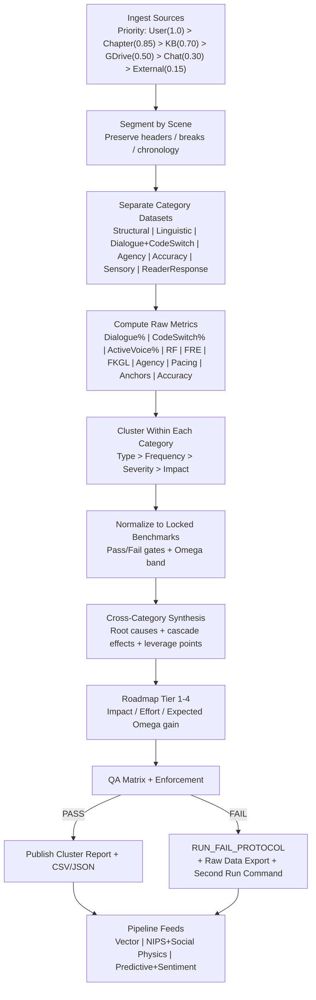

# Streamlined Cluster Report Framework for Claude AI

> **Version:** 1.0.0 | **Last updated:** 2026-05-19 | **Schema compat:** Claude Structured Outputs (JSON)

---

## Changelog

| Version | Date       | Summary                                                        |
|---------|------------|----------------------------------------------------------------|
| 1.0.0   | 2026-05-19 | Initial structured release. Separated concerns, tightened XML template, added numeric evidence weights, expanded examples, removed redundancy. |

---

## 1. Overview and Design Principles

This framework turns a multi-system analytics ecosystem (Omega/Hybrid scoring, RF enforcement, dialogue/code-switching audits, military/historical validation, and three downstream pipelines) into a single deliverable Claude can execute reliably and repeatably.

**Core principle:** separate *analysis* from *delivery*. Claude produces:

- **(A) Cluster Report** — a compact, human-readable ops dashboard (tables + ranked clusters + roadmap).
- **(B) Pipeline datasets** — machine-ingestible CSV/JSON blocks for Vector, NIPS/Social-Physics, and Predictive+Sentiment pipelines.

### Design rationale

| Principle | Implementation | Reference |
|-----------|---------------|-----------|
| Prompt clarity | XML-tagged sections prevent instruction bleed (context contaminating outputs, examples mistaken as content). | Anthropic recommends XML tags for multi-component prompts. |
| Schema compliance | Claude Structured Outputs (JSON schema-constrained decoding) guarantee valid, typed JSON for downstream pipelines. | Reduces parse failures and retries. |
| Threshold enforcement | All metrics normalize to locked benchmark bands with Pass/Fail gates — modeled on how readability formulas map numeric scores to difficulty bands. | Flesch Reading Ease / Flesch-Kincaid use the same pattern. |
| Deterministic code-switching | Word-level language ID, not sentence-level guessing. | Research shows word-level labeling is required for mixed-language text. |
| Active voice detection | "be" + past participle pattern with documented false-positive risk for copular "be." | Standard active/passive grammar definitions. |
| Fail-fast enforcement | If any benchmark fails, a Run-Fail Protocol fires: diagnose, export raw data, generate remediation plan, emit re-run command. No hedging. | — |

### Pipeline method notes

| Pipeline | Method | Basis |
|----------|--------|-------|
| **Vector** | Sentence/span embeddings (SBERT-style) for semantic similarity and clustering. | Sentence-BERT is designed for comparable vector representations. |
| **NIPS + Social Physics** | Model agent interactions as a network (who initiates, who controls turns, where agency concentrates). | Pentland's social physics: idea flow and interaction patterns as predictive signals. |
| **Predictive + Sentiment** | VADER baseline for time-series sentiment traces by scene/speaker. | VADER is a validated rule-based sentiment intensity model. |
| **Code-switching detection** | Word-level language ID (fastText pretrained models cover 100+ languages). | fastText language-ID models are explicitly positioned for token-level tagging. |
| **Readability** | FRE (words/sentence + syllables/word) and FKGL (maps difficulty to grade level). | Canonical Flesch formulas. |

---

## 2. Copy-Paste Prompt Template

Feed the XML block below directly to Claude. Replace all `{{PLACEHOLDER}}` variables with actual values (see the [Variable Reference](#3-variable-reference) for types and examples).

```xml
<CLUSTER_REPORT_PROMPT version="1.0.0" locale="en-US">

  <ROLE>
    You are Claude acting as an Omega/Hybrid Cluster Analyst and QA Enforcer.
    Output must be compact, execution-ready, and automation-friendly.
  </ROLE>

  <NONNEGOTIABLES>
    - Do not ask questions.
    - Use the Evidence-Weighting Model exactly as defined.
    - Normalize LOCKED metrics to their benchmarks and compute PASS/FAIL.
    - Report non-locked metrics (NarrativePct, SwitchEventsPerKWords, FRE, FKGL, reader-response proxies) as "reported/info" only — no PASS/FAIL gate.
    - If ANY locked benchmark fails: trigger RUN_FAIL_PROTOCOL and output raw datasets.
    - Always output: (A) Cluster Report (human) + (B) Pipeline datasets (CSV/JSON).
  </NONNEGOTIABLES>

  <!-- Evidence sources ranked by numeric weight. Highest wins on conflicts. -->
  <EVIDENCE_WEIGHTING_MODEL>
    <source id="user_instruction"   weight="1.00" rank="1" description="Direct user instructions and locked benchmarks" />
    <source id="chapter_text"       weight="0.85" rank="2" description="The chapter text being analyzed" />
    <source id="knowledge_base"     weight="0.70" rank="3" description="Connected knowledge base extractions" />
    <source id="google_drive"       weight="0.50" rank="4" description="Google Drive document extractions" />
    <source id="prior_chat"         weight="0.30" rank="5" description="Prior conversation context (only if not contradicted)" />
    <source id="external_sources"   weight="0.15" rank="6" description="External validation sources" />
  </EVIDENCE_WEIGHTING_MODEL>

  <LOCKED_BENCHMARKS>
    <!-- All metrics must normalize to these targets. Failure triggers RUN_FAIL_PROTOCOL. -->
    <benchmark id="OmegaScore"          target="103-106"  fail_condition="outside range" />
    <benchmark id="RF"                  target="le:2.5"   fail_condition="gt:2.5" />
    <benchmark id="ActiveVoicePct"      target="ge:95"    fail_condition="lt:95" />
    <benchmark id="DialoguePct"         target="35-55"    fail_condition="outside range" />
    <benchmark id="CodeSwitchingPct"    target="15-35"    fail_condition="outside range" />
    <benchmark id="DecisionPerScene"          target="ge:1"     fail_condition="any_scene_lt:1" note="FAIL if ANY scene has &lt; 1 decision; do not average across scenes" />
    <benchmark id="SensoryAnchorsPerParagraph" target="ge:1"     fail_condition="lt:1" />
    <benchmark id="AccuracyPct"         target="ge:95"    fail_condition="lt:95" />
    <benchmark id="PacingDistribution"  target="REQUIRED" fail_condition="missing" />
  </LOCKED_BENCHMARKS>

  <INPUTS>
    <chapter_metadata>
      <field name="chapter_id"     type="string"  example="CH-07"           /><!-- Unique chapter identifier -->
      <field name="chapter_title"  type="string"  example="The Last Convoy" /><!-- Human-readable title -->
      <field name="draft_version"  type="string"  example="v3.2"            /><!-- Semantic or sequential version -->
      <field name="time_period"    type="string"  example="1944-06, Normandy" /><!-- In-story time and setting -->
      <field name="pov_mode"       type="enum"    values="1st|3rd-limited|3rd-omniscient|2nd" />
      <field name="word_count"     type="integer" example="4820"            />
      <field name="scene_headers"  type="string[]" example="['S1: Arrival','S2: Ambush','S3: Aftermath']" />
      <field name="scene_breaks"   type="string"  example="###"            /><!-- Marker used for scene breaks -->
      <!-- Replace {{VAR}} placeholders below with actual values -->
      chapter_id: {{CHAPTER_ID}}
      chapter_title: {{CHAPTER_TITLE}}
      draft_version: {{DRAFT_VERSION}}
      time_period: {{TIME_PERIOD}}
      pov_mode: {{POV_MODE}}
      word_count: {{WORD_COUNT}}
      scene_headers: {{SCENE_HEADERS_LIST_OR_TEXT}}
      scene_breaks: {{SCENE_BREAK_MARKERS}}
    </chapter_metadata>

    <chapter_text>
      <![CDATA[
      {{PASTE_CHAPTER_TEXT_HERE}}
      ]]>
    </chapter_text>

    <knowledge_base_extraction>
      <!-- type: string, "connected" or "not_connected" -->
      status: {{KB_STATUS}}
      query_log: {{KB_QUERY_LOG}}
      extracted_facts_and_rules: {{KB_FACTS}}
    </knowledge_base_extraction>

    <google_drive_extraction>
      <!-- type: string, "connected" or "not_connected" -->
      status: {{GDRIVE_STATUS}}
      file_list_scanned: {{GDRIVE_FILE_IDS_TITLES_DATES}}
      extracted_rules_templates: {{GDRIVE_EXTRACTS}}
    </google_drive_extraction>

    <external_validation_sources>
      <!-- type: string, "used" or "not_used" -->
      status: {{EXTERNAL_STATUS}}
      military_historical_cultural_sources_used: {{CITED_SOURCES}}
      validation_notes: {{VALIDATION_NOTES}}
    </external_validation_sources>
  </INPUTS>

  <PROCESSING_STEPS>
    1) Segment by scene. Preserve headers, breaks, and chronology — do NOT alter structure.
    2) Separate text into category datasets:
       Structural | Linguistic | Dialogue_CodeSwitching | Character_Agency |
       Cultural_Historical_Military | Sensory_Immersion | Reader_Response | Accuracy.
    3) Compute raw metrics per METRICS_SPEC. Extract minimal evidence snippets.
    4) Cluster issues within each category by type, frequency, severity, impact.
    5) Normalize LOCKED metrics to LOCKED_BENCHMARKS and compute PASS/FAIL.
       Non-locked metrics (NarrativePct, SwitchEventsPerKWords, FRE, FKGL,
       reader-response proxies): report as info only — no PASS/FAIL gate.
    6) Cross-category synthesis: systemic failures, cascade effects, leverage points.
    7) Produce Tier 1-4 roadmap: impact, effort, expected Omega gain, clusters resolved.
    8) Run QA matrix. If any benchmark fails, trigger RUN_FAIL_PROTOCOL.
  </PROCESSING_STEPS>

  <METRICS_SPEC>
    <!-- Dialogue vs Narrative -->
    <metric id="DialoguePct"     formula="dialogue_words / total_words * 100"
            detection="Text inside double quotes = dialogue. Document alt quote styles if found." />
    <metric id="NarrativePct"    formula="100 - DialoguePct" />

    <!-- Code-switching (word-level language ID required) -->
    <metric id="CodeSwitchingPct"
            formula="non_English_tokens_in_dialogue / total_dialogue_tokens * 100"
            zero_guard="if total_dialogue_tokens == 0: output 0.0 and flag DIALOGUE_ABSENT" />
    <metric id="SwitchEventsPerKWords"
            formula="count(language_switch_boundaries) / (dialogue_words / 1000)"
            zero_guard="if dialogue_words == 0: output 0.0 and flag DIALOGUE_ABSENT" />

    <!-- Active voice -->
    <metric id="ActiveVoicePct"
            formula="clause_level_check"
            passive_proxy="(be|been|being|was|were|is|are|am) + past_participle [+ optional by-agent]"
            note="Report false-positive risks (copula vs passive) as BUG_RISK." />

    <!-- Readability -->
    <metric id="FRE"  formula="206.835 - 1.015*(words/sentences) - 84.6*(syllables/words)" />
    <metric id="FKGL" formula="0.39*(words/sentences) + 11.8*(syllables/words) - 15.59" />
    <metric id="RF"   formula="internal_RF_method_or_RF_PROXY"
            note="If RF method undefined, compute RF_PROXY and label it." />

    <!-- Agency -->
    <metric id="DecisionPerScene"
            formula="for_each_scene: count(explicit_POV_decisions_with_consequence_markers)"
            unit="decisions per scene"
            pass="every scene >= 1; chapter passes only if ALL scenes pass" />

    <!-- Pacing -->
    <metric id="PacingDistribution"
            formula="classify_paragraphs"
            categories="ACTION | DIALOGUE | REFLECTION | EXPOSITION | TRANSITION"
            output="percentage per category" />

    <!-- Sensory -->
    <metric id="SensoryAnchorsPerParagraph"
            formula="total_sensory_anchors / total_paragraphs"
            unit="average anchors per paragraph (not percentage)" />

    <!-- Accuracy -->
    <metric id="AccuracyPct"
            formula="validated_claims / total_audited_claims * 100"
            min_audit_sample="20 claims (or all if fewer)"
            zero_guard="if total_audited_claims == 0: output N/A and flag NO_AUDITABLE_CLAIMS" />

    <!-- Omega -->
    <metric id="OmegaScore" formula="internal_omega_model"
            bands="106+=elite | 103-105=target | lt:103=fail" />

    <!-- Reader Response (output UNAVAILABLE + proxy if model missing) -->
    <metric id="RetentionProxyPct"      formula="internal_model_or_UNAVAILABLE" />
    <metric id="FatigueIndex"           formula="internal_model_or_UNAVAILABLE" />
    <metric id="NeuroEngagementIndex"   formula="internal_model_or_UNAVAILABLE" />
  </METRICS_SPEC>

  <OUTPUT_FORMAT>
    <A_CLUSTER_REPORT_HUMAN>
      <!-- Keep each section tight. Tables over prose. -->
      1) Source Ingestion Summary
      2) Quant Metrics vs Benchmarks (table)
      3) Category Datasets Summary (counts only)
      4) Cluster Analysis per category (top clusters only)
      5) Cross-Category Synthesis (root causes + cascade effects + leverage points)
      6) Prioritized Roadmap (Tier 1-4)
      7) Pipeline-ready datasets (links to CSV/JSON blocks in this output)
      8) Final QA Checklist + PASS/FAIL
    </A_CLUSTER_REPORT_HUMAN>

    <B_PIPELINE_DATASETS_MACHINE>
      <!-- Populate each block with actual computed data (not placeholders).
           Use the tag names below as output wrappers. -->
      <!-- Category datasets (one per PROCESSING_STEPS category) -->
      1)  <CSV_METRICS> ... </CSV_METRICS>
      2)  <JSON_STRUCTURAL> ... </JSON_STRUCTURAL>
      3)  <JSON_LINGUISTIC> ... </JSON_LINGUISTIC>
      4)  <JSON_DIALOGUE_CODESWITCH> ... </JSON_DIALOGUE_CODESWITCH>
      5)  <JSON_AGENCY> ... </JSON_AGENCY>
      6)  <JSON_ACCURACY_AUDIT> ... </JSON_ACCURACY_AUDIT>
      7)  <JSON_SENSORY_IMMERSION> ... </JSON_SENSORY_IMMERSION>
      8)  <JSON_CULTURAL_HISTORICAL_MILITARY> ... </JSON_CULTURAL_HISTORICAL_MILITARY>
      9)  <JSON_READER_RESPONSE> ... </JSON_READER_RESPONSE>
      <!-- Downstream pipeline feeds -->
      10) <JSON_VECTOR_PIPELINE> ... </JSON_VECTOR_PIPELINE>
      11) <JSON_NIPS_SOCIAL_PHYSICS_PIPELINE> ... </JSON_NIPS_SOCIAL_PHYSICS_PIPELINE>
      12) <JSON_PREDICTIVE_SENTIMENT_PIPELINE> ... </JSON_PREDICTIVE_SENTIMENT_PIPELINE>
    </B_PIPELINE_DATASETS_MACHINE>
  </OUTPUT_FORMAT>

  <RUN_FAIL_PROTOCOL>
    <!-- Trigger if ANY benchmark fails. No hedging. -->
    Trigger: any LOCKED_BENCHMARK status = FAIL
    Output:
    - FAIL_SUMMARY: which benchmarks failed, actual vs target
    - ROOT_CAUSE_CLUSTERS: cluster_id list with severity and impact
    - RAW_DATA_EXPORT_CONFIRMATION: confirm CSV/JSON blocks are included
    - TIER_1_REMEDIATION: top 5 actions ranked by expected Omega gain
    - SECOND_RUN_COMMAND_BLOCK: exact instructions to rerun after fixes
  </RUN_FAIL_PROTOCOL>

</CLUSTER_REPORT_PROMPT>
```

---

## 3. Variable Reference

All `{{PLACEHOLDER}}` variables used in the template above.

| Variable | Type | Valid Values / Format | Description |
|----------|------|----------------------|-------------|
| `{{CHAPTER_ID}}` | string | `CH-01`, `CH-12` | Unique chapter identifier |
| `{{CHAPTER_TITLE}}` | string | Free text | Human-readable chapter title |
| `{{DRAFT_VERSION}}` | string | `v1.0`, `v3.2`, `draft-final` | Semantic or sequential version label |
| `{{TIME_PERIOD}}` | string | `1944-06, Normandy` | In-story time period and setting |
| `{{POV_MODE}}` | enum | `1st`, `3rd-limited`, `3rd-omniscient`, `2nd` | Point-of-view mode |
| `{{WORD_COUNT}}` | integer | `4820` | Total word count of chapter text |
| `{{SCENE_HEADERS_LIST_OR_TEXT}}` | string[] | `['S1: Arrival', 'S2: Ambush']` | List of scene headers in order |
| `{{SCENE_BREAK_MARKERS}}` | string | `###`, `***`, `---` | Marker(s) used for scene breaks |
| `{{PASTE_CHAPTER_TEXT_HERE}}` | text | Full chapter content | Entire chapter text inside CDATA |
| `{{KB_STATUS}}` | string | `connected`, `not_connected` | Knowledge base connection status |
| `{{KB_QUERY_LOG}}` | string | Query text or `N/A` | Queries run against knowledge base |
| `{{KB_FACTS}}` | string | Extracted text or `N/A` | Facts and rules extracted from KB |
| `{{GDRIVE_STATUS}}` | string | `connected`, `not_connected` | Google Drive connection status |
| `{{GDRIVE_FILE_IDS_TITLES_DATES}}` | string | File metadata or `N/A` | Files scanned from Google Drive |
| `{{GDRIVE_EXTRACTS}}` | string | Extracted text or `N/A` | Rules/templates extracted from Drive |
| `{{EXTERNAL_STATUS}}` | string | `used`, `not_used` | Whether external sources were consulted |
| `{{CITED_SOURCES}}` | string | Source list or `N/A` | Military/historical/cultural sources used |
| `{{VALIDATION_NOTES}}` | string | Free text or `N/A` | Notes on external validation |

---

## 4. Example Cluster Report

Numbers are illustrative for a hypothetical chapter.

### 4.1 Source Ingestion Summary

| Source | Used | Weight | Notes |
|--------|------|--------|-------|
| user_instruction | Yes | 1.00 | Locked benchmarks applied. |
| chapter_text | Yes | 0.85 | Segmented by 6 scenes. |
| knowledge_base | Yes | 0.70 | Pulled military ranks + period-accurate terminology. |
| google_drive | Yes | 0.50 | Loaded Omega audit patterns + sensory anchors spec. |
| prior_chat | Yes | 0.30 | Used only where not contradicted by higher-weight sources. |
| external_sources | Yes | 0.15 | Military/historical spot-checks. |

### 4.2 Benchmarks vs Actuals

| Metric | Benchmark | Actual | Normalized | Pass |
|--------|-----------|--------|------------|------|
| OmegaScore | 103-106 | 104.2 | 0.73 | PASS |
| RF | &le; 2.5 | 2.7 | -0.08 | **FAIL** |
| ActiveVoice % | &ge; 95% | 96.4% | 1.03 | PASS |
| Dialogue % | 35-55% | 33.1% | 0.95 | **FAIL** |
| Code-switching % | 15-35% | 19.8% | 1.00 | PASS |
| Agency (decisions/scene) | &ge; 1 | 0.7 | 0.70 | **FAIL** |
| Sensory anchors/paragraph | &ge; 1 | 1.2 | 1.20 | PASS |
| Accuracy % | &ge; 95% | 96% | 1.01 | PASS |
| Pacing distribution | Required | Provided | -- | PASS |
| FRE | (reported) | 61.0 | -- | -- |
| FKGL | (reported) | 9.8 | -- | -- |

### 4.3 Category Datasets Summary

| Category | Records | Clusters | High-Severity Clusters |
|----------|---------|----------|------------------------|
| Structural | 18 | 3 | 1 |
| Linguistic | 44 | 5 | 2 |
| Dialogue/Code-switching | 22 | 3 | 1 |
| Character/Agency | 16 | 4 | 2 |
| Cultural/Historical/Military | 12 | 2 | 0 |
| Sensory/Immersion | 31 | 3 | 0 |
| Reader Response | 14 | 2 | 1 |

### 4.4 Top Clusters

| Category | Cluster Type | Freq | Severity | Impact | Notes |
|----------|-------------|------|----------|--------|-------|
| Character/Agency | "POV observes, doesn't decide" | 6 | 0.86 | High | Scenes 2, 4, 5 lack irreversible choice. |
| Dialogue | "Dialogue under target %" | 1 | 0.70 | Med | Convert exposition beats into conflict dialogue. |
| Reader Response | "RF spike in mid-scene exposition" | 4 | 0.78 | High | Long paragraph stacks; compress + reallocate to agency action. |

### 4.5 Cross-Category Synthesis

**Systemic failure:** Agency drought drives down dialogue share and drives up RF. When the POV isn't choosing, the prose compensates with explanation — a "tell inflation" cascade. Fixing agency tends to fix pacing and friction as a downstream effect.

**Leverage points:**

1. Insert one decisive action per scene with consequence (fixes Agency + RF).
2. Convert 2-3 explanatory paragraphs into confrontation dialogue (fixes Dialogue %).
3. Enforce paragraph-level sensory anchors only where tension rises (avoid oversaturation).

### 4.6 Prioritized Roadmap

| Tier | Fix | Effort | Impact | Expected Omega Gain | Resolves Clusters |
|------|-----|--------|--------|---------------------|-------------------|
| 1 | Add &ge;1 decision/scene (irreversible where possible) | Med | High | +0.8 to +1.4 | Agency drought, RF spike |
| 1 | Convert 300-500 words expository to conflict dialogue | Med | High | +0.6 to +1.0 | Dialogue under target |
| 2 | Trim passive proxies + "be" clusters in exposition | Low | Med | +0.2 to +0.4 | Linguistic severity |
| 3 | Tighten pacing distribution (reduce exposition share by 5-8%) | Med | Med | +0.2 to +0.5 | Reader fatigue |
| 4 | Expand accuracy audit sample from 20 to 40 claims | High | Low | +0.0 to +0.2 | Confidence, not score |

### 4.7 QA Status

**Status: FAIL** (RF > 2.5; Dialogue % below range; Agency below minimum).

RUN_FAIL_PROTOCOL triggered. CSV/JSON blocks included below.

---

## 5. Example Pipeline Datasets

### 5.1 CSV_METRICS

```csv
chapter_id,metric,value,benchmark,pass,notes
CH-07,OmegaScore,104.2,"103-106",true,Within target band
CH-07,RF,2.7,"le:2.5",false,Mid-scene exposition density spike in S3-S4
CH-07,ActiveVoicePct,96.4,"ge:95",true,3 passive instances flagged; 1 copula false-positive
CH-07,DialoguePct,33.1,"35-55",false,Convert exposition beats to conflict dialogue
CH-07,CodeSwitchingPct,19.8,"15-35",true,Spanish code-switching well-distributed across S1-S5
CH-07,DecisionPerScene,0.7,"ge:1",false,Scenes 2 4 5 have zero explicit POV decisions
CH-07,AccuracyPct,96.0,"ge:95",true,24/25 claims validated; 1 uniform detail uncertain
CH-07,SensoryAnchorsPerParagraph,1.2,"ge:1",true,83% of paragraphs have at least 1 anchor
CH-07,FRE,61.0,reported,info,Standard difficulty range
CH-07,FKGL,9.8,reported,info,Grade 9-10 reading level
CH-07,PacingAction,22,required,info,22% of paragraphs classified ACTION
CH-07,PacingDialogue,28,required,info,28% classified DIALOGUE
CH-07,PacingReflection,18,required,info,18% classified REFLECTION
CH-07,PacingExposition,24,required,info,24% classified EXPOSITION
CH-07,PacingTransition,8,required,info,8% classified TRANSITION
CH-07,PacingDistribution,provided,REQUIRED,true,All 5 pacing categories reported
```

### 5.2 JSON_VECTOR_PIPELINE

```json
{
  "chapter_id": "CH-07",
  "unit": "scene",
  "embedding_model": "all-MiniLM-L6-v2",
  "generated_at": "2026-05-19T00:00:00Z",
  "records": [
    {
      "scene_id": "S1",
      "text_span_id": "S1-P3",
      "categories": ["Structural", "Sensory_Immersion"],
      "severity": 0.42,
      "text": "The convoy rolled through dust that tasted of chalk and diesel...",
      "cluster_id": "sensory-density-low",
      "metadata": {"pov": "3rd-limited", "location": "Route Nationale 13", "word_count": 87}
    },
    {
      "scene_id": "S2",
      "text_span_id": "S2-P1",
      "categories": ["Character_Agency", "Dialogue_CodeSwitching"],
      "severity": 0.86,
      "text": "He watched the captain give the order. The men moved. He stayed.",
      "cluster_id": "agency-drought",
      "metadata": {"pov": "3rd-limited", "location": "crossroads near Carentan", "word_count": 62}
    },
    {
      "scene_id": "S4",
      "text_span_id": "S4-P5",
      "categories": ["Reader_Response", "Linguistic"],
      "severity": 0.78,
      "text": "The historical context of the 29th Division's advance through...",
      "cluster_id": "rf-spike-exposition",
      "metadata": {"pov": "3rd-limited", "location": "hedgerow country", "word_count": 143}
    }
  ]
}
```

### 5.3 JSON_NIPS_SOCIAL_PHYSICS_PIPELINE

```json
{
  "chapter_id": "CH-07",
  "model": "social_physics_interaction_network",
  "generated_at": "2026-05-19T00:00:00Z",
  "agents": [
    {"agent_id": "protagonist", "role": "POV", "scenes_active": ["S1","S2","S3","S4","S5","S6"]},
    {"agent_id": "captain_ruiz", "role": "authority", "scenes_active": ["S1","S2","S5"]},
    {"agent_id": "pvt_jackson", "role": "peer", "scenes_active": ["S2","S3","S6"]}
  ],
  "interactions": [
    {"scene_id": "S1", "initiator": "captain_ruiz", "responder": "protagonist", "type": "directive", "agency_transfer": false},
    {"scene_id": "S2", "initiator": "captain_ruiz", "responder": "protagonist", "type": "directive", "agency_transfer": false},
    {"scene_id": "S2", "initiator": "pvt_jackson", "responder": "protagonist", "type": "challenge", "agency_transfer": false},
    {"scene_id": "S3", "initiator": "protagonist", "responder": "pvt_jackson", "type": "decision", "agency_transfer": true},
    {"scene_id": "S5", "initiator": "captain_ruiz", "responder": "protagonist", "type": "directive", "agency_transfer": false}
  ],
  "network_metrics": {
    "protagonist_initiation_rate": 0.20,
    "protagonist_agency_scenes": 1,
    "total_scenes": 6,
    "idea_flow_centrality": {"protagonist": 0.31, "captain_ruiz": 0.52, "pvt_jackson": 0.17},
    "turn_control_ratio": {"protagonist": 0.25, "captain_ruiz": 0.55, "pvt_jackson": 0.20}
  }
}
```

### 5.4 JSON_PREDICTIVE_SENTIMENT_PIPELINE

```json
{
  "chapter_id": "CH-07",
  "model": "vader_sentiment_trace",
  "generated_at": "2026-05-19T00:00:00Z",
  "scene_traces": [
    {"scene_id": "S1", "avg_compound": 0.12, "min_compound": -0.34, "max_compound": 0.65, "dominant_tone": "neutral-tense"},
    {"scene_id": "S2", "avg_compound": -0.28, "min_compound": -0.72, "max_compound": 0.10, "dominant_tone": "negative-conflict"},
    {"scene_id": "S3", "avg_compound": 0.35, "min_compound": -0.15, "max_compound": 0.82, "dominant_tone": "positive-resolution"},
    {"scene_id": "S4", "avg_compound": -0.05, "min_compound": -0.41, "max_compound": 0.22, "dominant_tone": "neutral-expository"},
    {"scene_id": "S5", "avg_compound": -0.45, "min_compound": -0.88, "max_compound": -0.10, "dominant_tone": "negative-crisis"},
    {"scene_id": "S6", "avg_compound": 0.55, "min_compound": 0.12, "max_compound": 0.91, "dominant_tone": "positive-catharsis"}
  ],
  "speaker_traces": [
    {"speaker": "protagonist", "avg_compound": 0.04, "arc_shape": "U-curve", "volatility": 0.38},
    {"speaker": "captain_ruiz", "avg_compound": -0.22, "arc_shape": "descending", "volatility": 0.15},
    {"speaker": "pvt_jackson", "avg_compound": 0.18, "arc_shape": "ascending", "volatility": 0.42}
  ],
  "chapter_sentiment_arc": {
    "shape": "W-curve",
    "tension_peaks": ["S2", "S5"],
    "resolution_valleys": ["S3", "S6"],
    "fatigue_risk_zones": ["S4"]
  }
}
```

---

## 6. Pipeline Flow



---

## 7. Cross-Chapter Vector Heatmap (Example)

Visualizes issue density across chapters and categories.

```svg
<svg xmlns="http://www.w3.org/2000/svg" width="580" height="280" viewBox="0 0 580 280">
  <style>
    text { font-family: monospace; font-size: 11px; fill: #333; }
    .label { font-weight: bold; }
    .lo  { fill: #e8f5e9; }
    .m1  { fill: #c8e6c9; }
    .m2  { fill: #ffecb3; }
    .m3  { fill: #ffcc80; }
    .hi  { fill: #ef9a9a; }
    .cr  { fill: #c62828; }
    .header { font-size: 13px; font-weight: bold; }
  </style>

  <text x="10" y="20" class="header">Cross-Chapter Vector Heatmap</text>

  <!-- Column headers -->
  <text x="180" y="45" class="label">CH01</text>
  <text x="240" y="45" class="label">CH02</text>
  <text x="300" y="45" class="label">CH03</text>
  <text x="360" y="45" class="label">CH04</text>
  <text x="420" y="45" class="label">CH05</text>
  <text x="480" y="45" class="label">CH06</text>

  <!-- Row: Structural -->
  <text x="10" y="68">Structural</text>
  <rect x="175" y="55" width="45" height="20" class="m1" rx="2"/>
  <rect x="235" y="55" width="45" height="20" class="m1" rx="2"/>
  <rect x="295" y="55" width="45" height="20" class="m2" rx="2"/>
  <rect x="355" y="55" width="45" height="20" class="m2" rx="2"/>
  <rect x="415" y="55" width="45" height="20" class="m1" rx="2"/>
  <rect x="475" y="55" width="45" height="20" class="m1" rx="2"/>

  <!-- Row: Linguistic -->
  <text x="10" y="93">Linguistic</text>
  <rect x="175" y="80" width="45" height="20" class="m1" rx="2"/>
  <rect x="235" y="80" width="45" height="20" class="m1" rx="2"/>
  <rect x="295" y="80" width="45" height="20" class="m2" rx="2"/>
  <rect x="355" y="80" width="45" height="20" class="m3" rx="2"/>
  <rect x="415" y="80" width="45" height="20" class="m1" rx="2"/>
  <rect x="475" y="80" width="45" height="20" class="m1" rx="2"/>

  <!-- Row: Dialogue -->
  <text x="10" y="118">Dialogue</text>
  <rect x="175" y="105" width="45" height="20" class="m2" rx="2"/>
  <rect x="235" y="105" width="45" height="20" class="m3" rx="2"/>
  <rect x="295" y="105" width="45" height="20" class="m2" rx="2"/>
  <rect x="355" y="105" width="45" height="20" class="m1" rx="2"/>
  <rect x="415" y="105" width="45" height="20" class="m2" rx="2"/>
  <rect x="475" y="105" width="45" height="20" class="m2" rx="2"/>

  <!-- Row: Code-switching -->
  <text x="10" y="143">Code-switch</text>
  <rect x="175" y="130" width="45" height="20" class="m1" rx="2"/>
  <rect x="235" y="130" width="45" height="20" class="m2" rx="2"/>
  <rect x="295" y="130" width="45" height="20" class="m2" rx="2"/>
  <rect x="355" y="130" width="45" height="20" class="m1" rx="2"/>
  <rect x="415" y="130" width="45" height="20" class="m2" rx="2"/>
  <rect x="475" y="130" width="45" height="20" class="m1" rx="2"/>

  <!-- Row: Agency -->
  <text x="10" y="168">Agency</text>
  <rect x="175" y="155" width="45" height="20" class="m2" rx="2"/>
  <rect x="235" y="155" width="45" height="20" class="cr" rx="2"/>
  <rect x="295" y="155" width="45" height="20" class="m3" rx="2"/>
  <rect x="355" y="155" width="45" height="20" class="m2" rx="2"/>
  <rect x="415" y="155" width="45" height="20" class="m1" rx="2"/>
  <rect x="475" y="155" width="45" height="20" class="m2" rx="2"/>

  <!-- Row: Accuracy -->
  <text x="10" y="193">Accuracy</text>
  <rect x="175" y="180" width="45" height="20" class="lo" rx="2"/>
  <rect x="235" y="180" width="45" height="20" class="lo" rx="2"/>
  <rect x="295" y="180" width="45" height="20" class="lo" rx="2"/>
  <rect x="355" y="180" width="45" height="20" class="lo" rx="2"/>
  <rect x="415" y="180" width="45" height="20" class="lo" rx="2"/>
  <rect x="475" y="180" width="45" height="20" class="lo" rx="2"/>

  <!-- Row: Sensory -->
  <text x="10" y="218">Sensory</text>
  <rect x="175" y="205" width="45" height="20" class="m2" rx="2"/>
  <rect x="235" y="205" width="45" height="20" class="m2" rx="2"/>
  <rect x="295" y="205" width="45" height="20" class="m3" rx="2"/>
  <rect x="355" y="205" width="45" height="20" class="m2" rx="2"/>
  <rect x="415" y="205" width="45" height="20" class="m2" rx="2"/>
  <rect x="475" y="205" width="45" height="20" class="m2" rx="2"/>

  <!-- Row: Reader Response -->
  <text x="10" y="243">Reader Resp</text>
  <rect x="175" y="230" width="45" height="20" class="m1" rx="2"/>
  <rect x="235" y="230" width="45" height="20" class="m2" rx="2"/>
  <rect x="295" y="230" width="45" height="20" class="m3" rx="2"/>
  <rect x="355" y="230" width="45" height="20" class="m2" rx="2"/>
  <rect x="415" y="230" width="45" height="20" class="m1" rx="2"/>
  <rect x="475" y="230" width="45" height="20" class="m2" rx="2"/>

  <!-- Legend -->
  <rect x="10" y="260" width="12" height="12" class="lo" rx="1"/><text x="26" y="270">Low</text>
  <rect x="60" y="260" width="12" height="12" class="m1" rx="1"/><text x="76" y="270">Mild</text>
  <rect x="118" y="260" width="12" height="12" class="m2" rx="1"/><text x="134" y="270">Medium</text>
  <rect x="188" y="260" width="12" height="12" class="m3" rx="1"/><text x="204" y="270">High</text>
  <rect x="248" y="260" width="12" height="12" class="hi" rx="1"/><text x="264" y="270">Severe</text>
  <rect x="318" y="260" width="12" height="12" class="cr" rx="1"/><text x="334" y="270">Critical</text>
</svg>
```
